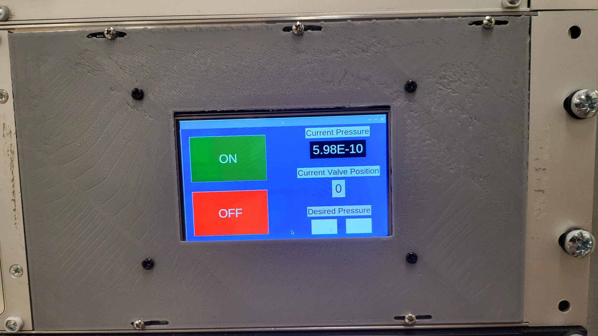

# Ozone Control Device

This code is intended to run on a Raspberry Pi with a 4 inch touch screen, connected to an Ion Gauge and Ozone Leak Valve.

To run, simply make the Serial connections (through USB), and run `python ozone_control.py`. Users may need to specify `python3` depending on their previous installations.

Once the connections are selected, and successfully made, the control GUI will pop up. Shown below is the working version of the device, rack mounted in the Falson Lab at Caltech.

